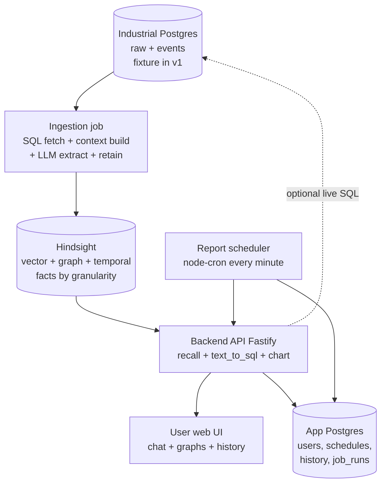

# 01 — Architecture: Boxes, Arrows, Boundaries

## 1. System context (why this shape?)

The user must not know about Postgres, cron, ingestion status, or Hindsight internals.
So we split the system into a **user-facing side** (chat + graphs + history) and an
**internal side** (SQL, context, extraction, memory). The only bridge is the API.

## 2. Box-by-box (what / why / where)

### 2.1 Industrial Postgres (read-only source of truth)
- **What:** raw production rows + event rows (alarms, downtimes, changeovers).
- **Why needed:** every number the user ever sees originates here. No manual CSV uploads.
- **Where in repo (fresh):** `apps/ingest/src/sql/*` reads it via `apps/api/src/db/machine-db.ts`
  (`pg.Pool`, statement timeout, transient retry). Pattern参考 DB-GPT
  `packages/dbgpt-core/src/dbgpt/datasource/rdbms/base.py` (SQLAlchemy engine+pool) and
  `packages/dbgpt-ext/src/dbgpt_ext/datasource/rdbms/conn_postgresql.py` (Postgres dialect)
  — we port the **pool + read-only + registry idea**, not the Python code.
- **How it works:** `SELECT`-only role. Every row carries `status: new | pending | ingested`.

### 2.2 Ingestion job (accuracy engine — Part 1)
- **What:** batch job: fetch new rows -> mark `pending` -> build context units (per
  granularity) -> LLM extracts facts -> `retain` to Hindsight -> mark `ingested`.
- **Why needed:** this is the accuracy guarantee. Chat never computes from raw rows
  directly; it recalls pre-validated facts. Crash-safety rule: **write to store BEFORE
  flipping the flag, never reverse**. A crash leaves `pending` rows retried next run.
- **Where:** `apps/ingest/src/{index.ts, pipeline.ts, checkpoint.ts, sql/, context/, extract/}`.
- **How:** see `02-part1-ingestion.md`.

### 2.3 Hindsight (memory)
- **What:** self-hosted vector + graph + temporal store. Partitioned by `bankId`.
- **Why needed:** covers semantic + keyword + graph traversal + time filtering without
  hand-building a knowledge graph. Runs on Postgres + vector extension, so the stack
  stays Postgres-centric.
- **Where:** `apps/api/src/hindsight/{port.ts, bank.ts, retain.ts, recall.ts, http-hindsight.ts,
  mock-hindsight.ts}`.
- **Bank scheme (locked):** `per-line` → `bankId = "line:<lineId>"` (e.g. `line:line-3`).
  Changing it later means re-ingesting everything.
- **How:** `retain(bankId, facts)` with `async:false` (ingestion waits for confirm);
  `recall(bankId, query, {budget, granularity?})` returns scored facts.

### 2.4 Backend API (bridge — Part 2)
- **What:** Fastify + TypeScript. Auth (username+password, argon2, JWT httpOnly cookie),
  `POST /chat` (summary + charts envelope), schedules CRUD, history, ops endpoints.
- **Why needed:** sole path the UI may call. Enforces auth, tool orchestration, output contract.
- **Where:** `apps/api/src/{index.ts, config.ts, auth/, chat/, hindsight/, db/, report/,
  history/, schedule/, settings/, ops/, llm/}`.
- **LLM orchestration:** Vercel AI SDK (`ai`) `streamText`/`generateText` with
  `maxSteps:5` tool loop. This replaces DB-GPT's Python ReAct loop
  (`packages/dbgpt-core/src/dbgpt/agent/expand/react_agent.py`,
  `tool_calling_agent.py`) — same idea (reason -> call tool -> observe -> repeat),
  different runtime. We do **not** port AWEL (`core/awel/dag/base.py`) — overkill.
- **How:** see `04-part2-chat-graphs.md`.

### 2.5 User web UI
- **What:** Vite + React + TS + Tailwind + shadcn/ui + Recharts. Chat + graphs + schedule
  settings + history. Elegant depth theme (CSS elevation tokens, no WebGL).
- **Why needed:** only thing the user sees. Must render both prose and charts from one
  answer envelope.
- **Where:** `apps/web-user/src/{App.tsx, views/Chat.tsx, views/History.tsx,
  components/ChartBlock.tsx, lib/api.ts}`.
- **DB-GPT UI reference:** `web/components/chat/chat-container.tsx` (chat shell),
  `web/components/chat/chat-content/chart-view.tsx` (Chart/SQL/Data tabs),
  `web/components/chart/{bar-chart,line-chart,pie-chart,table-chart}.tsx`,
  `web/components/chart/autoChart/index.tsx` (AVA auto-chart), `web/types/chat.ts`
  (ChartData type). Stack differs (they use Next.js + antd + @antv/g2); we **adopt the
  layout idea, rebuild with shadcn + Recharts**. See `05-ui-design.md`.

### 2.6 Report scheduler + app store
- **What:** `node-cron` every minute → `getDueSchedules(now)` → per-user
  `recall -> evaluate (pure logic, no LLM) -> draft summary (LLM) -> chart attach ->
  writeHistory(source:'report')`. App Postgres (Drizzle ORM) stores users, sessions,
  schedules, themes, history, job_runs.
- **Why needed:** user-configurable daily reports ("run at 8:15am") without fixed backend cron.
- **Where:** `apps/scheduler/src/{index.ts, due.ts, run-report.ts, evaluate.ts, deliver.ts}`
  + `apps/api/src/report/*` + `apps/api/src/db/app/schema.ts`.
- **DB-GPT reference:** `packages/dbgpt-app/src/dbgpt_app/scene/chat_dashboard/chat.py`
  (multi-chart dashboard generation) — we port the **multi-ChartData idea**, not the runner.

## 3. Trust / access boundary

| Side | Contains | Auth |
|---|---|---|
| User-facing | `web-user`, `POST /chat`, history, schedule settings | username+password JWT |
| Internal (builder-only) | industrial PG, ingestion job, Hindsight console, ops dashboard | separate ops credential, localhost/VPN |

The user UI never connects to Postgres or Hindsight directly — only via the API.
