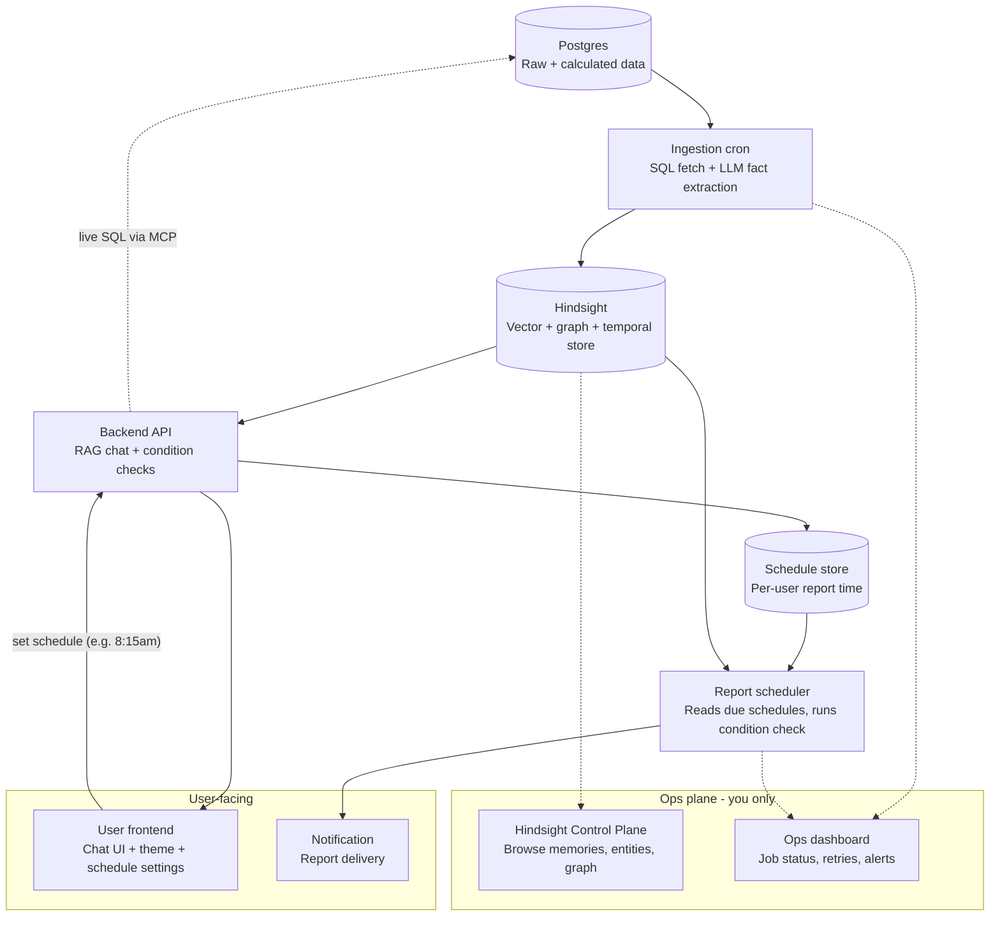

# Industrial RAG Chatbot — Project Plan

## 1. Overview

A RAG chatbot for a manufacturing line. Machine/production data lives in Postgres.
An ingestion pipeline turns that data into facts stored in Hindsight (a vector +
graph + temporal memory store). A backend API serves a chatbot that can recall
that stored knowledge and, when needed, pull live numbers straight from Postgres.
A separate scheduled job checks daily conditions and sends a report. Two
frontends exist: one for the end user, one internal ops plane for the builder.

The user should never see or need to know about the backend machinery —
Postgres, cron jobs, ingestion status, or Hindsight internals are all hidden
behind the chatbot and the report.

## 2. Architecture diagram

- **Solid arrows** = main data path (Postgres → ingestion → Hindsight → chatbot → user)
- **Dashed arrows** = side channels: live-SQL fallback via MCP, and the two ops-plane links
- **Subgraphs** = the trust/access boundary. Everything in `User-facing` is public.
  Everything in `Ops plane` is internal-only, separate auth, never exposed to end users.

## 3. Design decisions already made

- **Job 1 (SQL/calc) and Job 2 (AI ingestion) are one combined cron for now.**
  No team/ownership boundary exists yet to justify splitting them. Split them
  later — when the calculation logic gets its own owner — by extracting the
  internal function boundary (`get_calculated_data()` → `ingest_to_vectorstore()`)
  into two scripts with a staging handoff between them.
- **Job 3 (user report job) is fully separate** from ingestion. It only reads
  from Hindsight (never Postgres directly, never triggers ingestion), so it
  degrades gracefully if ingestion is late or failed that day.
- **Report schedule is user-configurable, not a fixed backend cron.** The user
  sets it themselves through the chat UI — e.g. "run this at 8:15am, I have a
  morning meeting" — and that becomes their personal report time. The backend
  parses that request into a schedule and stores it per user; a scheduler
  process reads what's due and runs the condition check + report for each user
  at their chosen time. This is a distinct config surface from the ingestion
  schedule below — the user only ever sees/sets *their* report time, never the
  ingestion cadence.
- **Crash-safety via status flags, not raw pipes.** Every row/batch is marked
  `pending` before the LLM call and `ingested` only after the Hindsight write
  succeeds. A mid-run crash just leaves rows in `pending`, and the next run
  retries them — nothing silently skipped or double-ingested. Write to the
  store *before* flipping the flag, never the reverse.
- **Store choice: Hindsight**, not a plain vector DB. It natively combines
  semantic search, keyword search, and graph traversal over linked entities,
  plus temporal awareness — which covers the "knowledge graph" requirement
  without building one by hand. Runs on Postgres + a vector extension under
  the hood, so the stack stays Postgres-centric. Needs its own LLM API key for
  fact extraction/entity resolution, separate from the chat LLM.
- **Postgres MCP is a live-query tool for the backend, not part of ingestion.**
  Ingestion is a scheduled batch job and doesn't need MCP. The chatbot uses it
  when a user asks something too fresh to have been ingested yet.
- **Two frontends, deliberately separate** — see Section 4 for the full breakdown.
- **Context builder will be multi-granularity, built later.** Different time
  scales (daily total, hourly breakdown, later maybe shift/per-machine) each
  become their own separate context unit, tagged with `granularity`, rather
  than one blended blob — so extracted facts keep the correct time-scope and
  recall can filter by it later. Open question to resolve when this is built:
  is "daily" independently queried from Postgres, or derived as a sum of the
  hourly units? Pick one — don't let two SQL paths silently disagree.

## 4. UI / Frontends

Two separate frontends, for two separate audiences. Not two views of one app —
two different apps with different auth and different purposes.

### 4.1 User frontend (public)
- Chat UI (the RAG chatbot)
- Theme setting (user-configurable)
- Report schedule settings — user tells the chatbot when to run their daily
  report (e.g. "8:15am, before my morning meeting"); this is parsed and saved,
  not a fixed time in code
- Daily report view
- Talks only to the Backend API — never touches Hindsight or Postgres directly
- Public-facing auth

### 4.2 Ops plane (internal, builder-only)
- **Hindsight Control Plane** — comes built-in with Hindsight, don't rebuild
  it. Browse memory banks, inspect facts/entities, view the entity
  relationship graph, check observation history. This is the window into
  *what got stored and how it's connected*.
- **Custom ops dashboard** (small, built by us) — pipeline/job health that
  Hindsight's Control Plane doesn't know about:
  - Ingestion cron run history (last run time, success/fail, pending count)
  - Manual "retry failed batch" trigger
  - Report scheduler status (per-user last report sent, condition result)
  - Alert if a cron hasn't run when expected
- Internal-only access (localhost/VPN/internal auth) — never exposed to end users
- Never used to "test the chatbot" — that always happens in the real user frontend

## 5. Function/module breakdown

### 5.1 Postgres connection layer — build now
- `check_db_connection()` — simple ping (`SELECT 1`), used at cron startup and
  by the ops dashboard health check
- `get_connection_pool()` — pooled connection, timeout/retry config
- `execute_query(sql, params)` — wrapper with retry-on-transient-failure and
  query timeout

### 5.2 SQL query set — build later (with context builder)
- `fetch_new_rows_since(last_checkpoint)` — incremental pull, not full scan
- `fetch_raw_sensor_data(machine_id, window)`
- `fetch_calculated_metrics(machine_id, window)` — OEE/MTBF/MTTR etc.
- `mark_rows_as_picked_up(row_ids)` — flips status to `pending` before handoff

### 5.3 Context builder — build later
- `build_context_blob(rows)` — groups rows by machine/line/time window into one
  structured unit
- `enrich_with_metadata(blob)` — attaches machine name, unit, threshold, line
  hierarchy
- `chunk_if_oversized(blob)` — splits before hitting context-window limits
- Multi-granularity: separate builder calls per granularity, e.g.
  `fetch_daily_summary(line_id, date)` and `fetch_hourly_breakdown(line_id, date)`,
  each tagged `granularity: daily` / `granularity: hourly`. Tag must survive
  through fact extraction into the stored fact.

### 5.4 Fact extraction (LLM) — build later
- `fact_extraction_prompt` — defines what counts as a "fact," the entity types
  (machine, line, metric, threshold, event), and the exact output JSON schema.
  **Lock this schema early — everything downstream depends on it.**
- `extract_facts(context_blob)` — calls the LLM with that prompt
- `validate_extraction_output(response)` — schema check, reject/retry on
  malformed JSON
- `retry_on_invalid_output()` — bounded retry with a stricter re-prompt

### 5.5 Hindsight ingestion — build now (stub the input until context builder exists)
- `get_bank_id(machine_id_or_line)` — bank-naming scheme (per-line? per-machine?
  per-plant?). **Decide once — changing it later means re-ingesting everything.**
- `retain_facts(bank_id, facts)` — Hindsight retain call
- `mark_rows_as_ingested(row_ids)` — flip only after retain succeeds

### 5.6 Backend API (chat side) — build now
- `recall_context(bank_id, user_query)` — Hindsight recall wrapper
- `live_sql_tool(query)` — MCP-exposed Postgres tool for "right now" questions
- `chat_prompt` — combines recalled facts + optional live data + user question
- `get_user_theme(user_id)` / `set_user_theme(user_id, theme)` — small settings
  store, separate from Hindsight
- `parse_schedule_request(user_message)` — LLM/rule-based parse of a natural
  request like "run it at 8:15am for my morning meeting" into a concrete
  schedule (time, recurrence)
- `get_user_schedule(user_id)` / `set_user_schedule(user_id, schedule)` —
  reads/writes the per-user schedule store

### 5.7 Report scheduler — build now
- `get_due_schedules(now)` — checks the schedule store for which users' report
  time has arrived (replaces a single fixed cron time)
- `fetch_latest_conditions(bank_id)` — pulls what's needed for today's check
- `evaluate_condition(data, thresholds)` — pure logic, no LLM
- `draft_report_prompt` — LLM call turning the evaluated result into readable text
- `send_notification(report, channel)` — delivery (email/Slack/webhook/etc.)

### 5.8 Ops dashboard — build now
- `get_job_status(job_name)` — last run time, success/fail, pending count
- `retry_failed_batch(job_name)` — manual re-trigger
- `check_cron_health()` — flags if a scheduled job hasn't run when expected

## 6. Build-now vs build-later split

**Build now:**
- Postgres connection layer (5.1)
- Hindsight ingestion wrapper (5.5) — with stubbed/sample context as input
- Backend API (5.6) — including schedule parsing + schedule store read/write
- User frontend (chat UI + theme + schedule settings)
- Report scheduler (5.7) — dynamic, driven by the schedule store, not a fixed time
- Ops dashboard (5.8)

**Build later (deferred — depends on team discussion / the calc layer landing):**
- SQL query set (5.2)
- Context builder (5.3)
- Fact-extraction prompt (5.4) — its shape depends on what the context builder
  actually produces

## 7. Open decisions to settle before building the deferred parts

1. Exact JSON schema for "a fact" coming out of the LLM.
2. The Hindsight bank-id scheme (per-machine / per-line / per-plant).
3. Whether "daily" totals are independently queried or derived from hourly sums.
